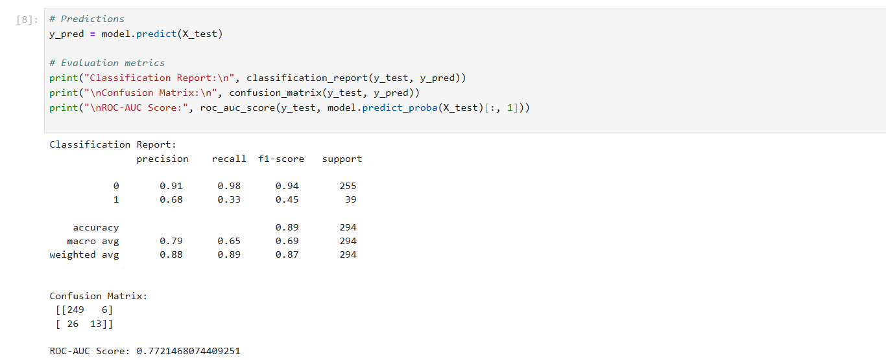
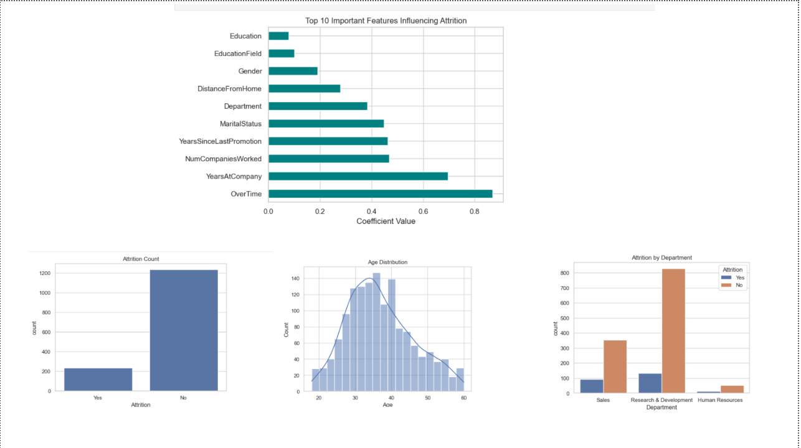

# Employee Attrition Prediction

## 📌 Project Overview
This project predicts **employee attrition** (whether an employee will leave the company) using **Logistic Regression**.  
The goal is to help organizations identify employees at risk of leaving and take preventive actions.

## 📂 Dataset
The dataset contains various employee details such as:
- Demographics
- Job role and department
- Salary and benefits
- Performance ratings
- Work-life balance

**Dataset Source:** *(Replace this with your dataset link or write "Included in repository" if you upload it)*

---

## 🛠 Steps Performed

### 1. Data Loading
- Loaded dataset using **pandas**.
- Checked dataset size, shape, and first few rows.

### 2. Exploratory Data Analysis (EDA)
- Checked missing values and data types.
- Created visualizations for:
  - Attrition rate distribution
  - Department-wise attrition
  - Age distribution
  - Correlation heatmap

### 3. Data Preprocessing
- Encoded categorical features using **Label Encoding**.
- Scaled numerical features using **StandardScaler**.

### 4. Model Training
- Applied **Logistic Regression**.
- Split dataset into **train** and **test** sets.
- Trained the model without warnings using `solver='liblinear'`.

### 5. Model Evaluation
- **Accuracy**
- **Precision**
- **Recall**
- **ROC-AUC Score**
- Classification Report

### 6. Feature Importance
- Extracted top 10 features influencing attrition.

---

## 📊 Key Results

- **Classification Report:
               precision    recall  f1-score   support

           0       0.91      0.98      0.94       255
           1       0.68      0.33      0.45        39

- **accuracy                           0.89       294
- **macro avg      0.79      0.65      0.69       294
- **weighted avg   0.88      0.89      0.87       294


- **Confusion Matrix:
 [[249   6]
 [ 26  13]]

- **ROC-AUC Score: 0.7721468074409251

- **Top features influencing attrition:** Age, MonthlyIncome, JobSatisfaction, OverTime, etc.

---

## 📸 Screenshots

### Model Results


### EDA Plots


---

## 📦 Requirements
Install the dependencies before running the notebook:
```bash
pip install pandas numpy matplotlib seaborn scikit-learn


